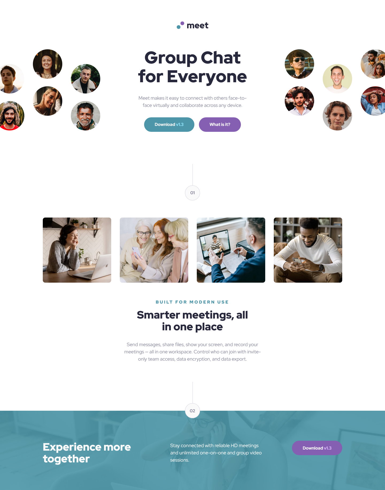

# Frontend Mentor - Meet landing page solution

This is my solution to the [Meet landing page challenge on Frontend Mentor](https://www.frontendmentor.io/challenges/meet-landing-page-rbTDS6OUR). Frontend Mentor challenges help you improve your coding skills by building realistic projects.

## Table of contents

- [Overview](#overview)
  - [The challenge](#the-challenge)
  - [Screenshot](#screenshot)
  - [Links](#links)
- [My process](#my-process)
  - [Built with](#built-with)
  - [What I learned](#what-i-learned)
  - [Continued development](#continued-development)
  - [Useful resources](#useful-resources)
- [Author](#author)

## Overview

### The challenge

Users should be able to:

- View the optimal layout depending on their device's screen size
- See hover states for interactive elements

### Screenshot

#### 📱 Mobile


#### 📲 Tablet


#### 💻 Desktop



### Links

- Solution URL: [My solution](https://www.frontendmentor.io/solutions/responsive-landing-page-with-css-grid-and-flexbox-45x9ovAJ_r)
- Live Site URL: [Live site URL](https://meet-landing-page-jiahe.netlify.app/)

## My process

### Built with

- Semantic HTML5 markup
- CSS custom properties
- Flexbox
- CSS Grid

### What I learned

While building this component, I practiced:

- Using CSS Grid and Flexbox for responsive layouts

- Applying margin-left: auto in Flexbox to push an element to the right within a container

- I learned how to set a background image for the footer using position: absolute and z-index: -1, and how to apply a background color to cover the entire footer.

- Creating a step indicator using Flexbox with the code below:

```html
<div class="step-indicator step-indicator--2">
  <div class="line"></div>
  <div class="number">02</div>
</div>
```

```css
.step-indicator {
  display: flex;
  flex-direction: column;
  justify-content: center;
  align-items: center;
}

.number {
  background-color: var(--color-white);
  width: 56px;
  height: 56px;
  border: 1px solid var(--color-grey-light);
  border-radius: 50%;
  font-weight: 800;
  color: var(--color-grey-medium);
  font-size: 16px;

  display: flex;
  align-items: center;
  justify-content: center;
}

.line {
  width: 1px;
  height: 80px;
  background-color: var(--color-grey-light);
}
```

### Continued development

I think I should improve my responsive layouts by using CSS Grid more effectively and using rem units consistently. In this project, I didn’t change the root font-size in the HTML because I still find it challenging to adjust spacing and text sizes for different screen sizes.

### Useful resources

- [Google font -- Red Hat Display](https://fonts.google.com/specimen/Red+Hat+Display)

## Author

- Frontend Mentor - [@JiaHe35354](https://www.frontendmentor.io/profile/JiaHe35354)
